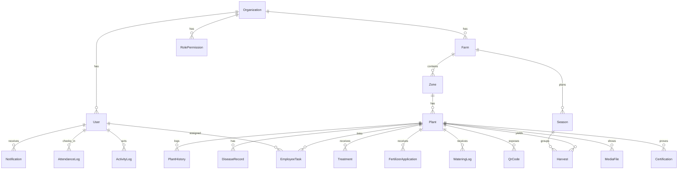
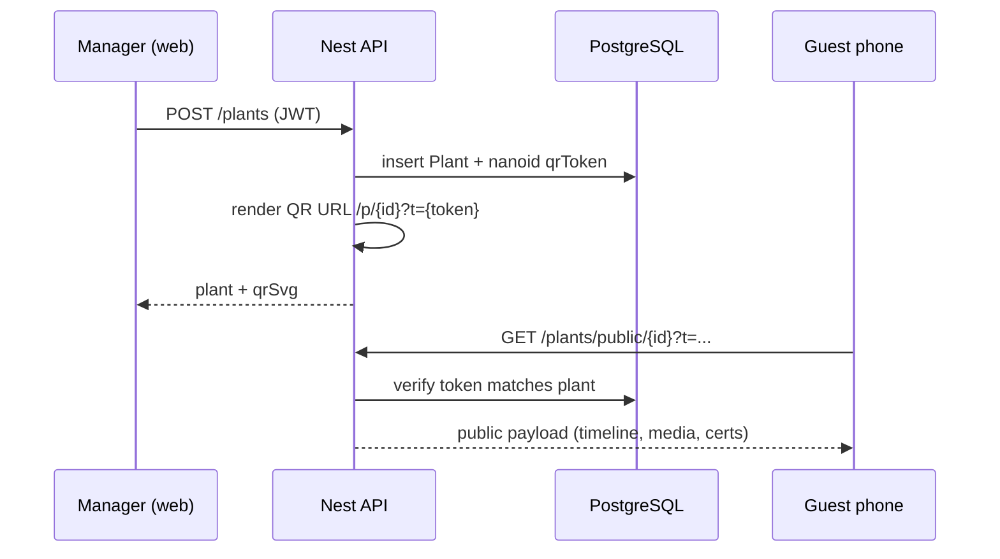
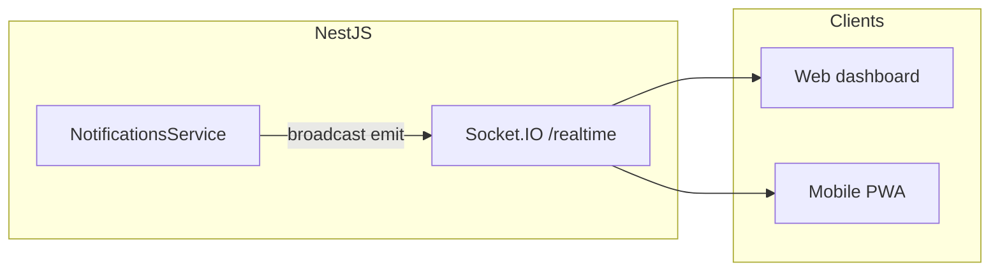

# Architecture & diagrams

## ERD (high level)

## QR workflow (sequence)

## Realtime notifications

Production hardening: authenticate socket handshake (JWT), join rooms `org:{id}` / `user:{id}`, optionally scale with Redis adapter.

## CI/CD (suggested)

- Lint + test + `prisma validate` on PR.
- Build Docker images; run `prisma migrate deploy` in release job.
- Secrets: JWT secrets, `DATABASE_URL`, S3 keys via vault / GitHub OIDC.
